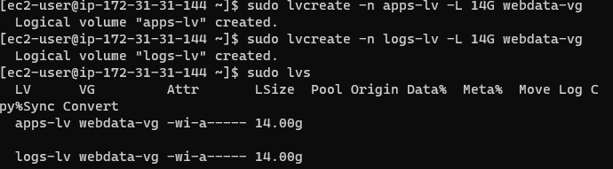

## DOCUMENTATION OF PROJECT 6

Project 6 is all about deplyoying a web solution based on wordpress. 

For this project will make use of redhat linux os.  Launch two linux server, one to serve as the web server and the second to serve as the database server. Now  create 3 volumes in the same AZ as your Web Server EC2, each of 10 GiB.

Now lets start the configuration. Use command `lsblk` to check what block devices are attaced to the server. Use `df -h` command to see all mounts and free space on your server.

Now use gdisk utility to create partitions on each of the 3 disks. 

The above image shows that we have succesfully created partitions

Now we install lvm2 package using the command `sudo yum install lvm2`.  Run `sudo lvmdiskscan` command to check for available partitions.

Now use pvcreate utility to mark each of the 3 disks as physical volume to be used LVM

The above image shows that we have succesfully marked the disks as physical volume

Now use vgcreate utility to add all 3 PVs to a volume group (VG). Use command `sudo vgcreate webdata-vg /dev/xvdh1 /dev/xvdg1 /dev/xvdf1`

Now use lvcreate utility to create 2 logical volumes

The above image shows the commands used .

Verify the entire setup using the command  
`sudo vgdisplay -v #view complete setup - VG, PV, and LV` and 
`sudo lsblk` 

Now we move to the next step.

Now we use mkfs.ext4 to format the logical volumes with ext4 file system
use command `sudo mkfs -t ext4 /dev/webdata-vg/apps-lv && sudo mkfs -t ext4 /dev/webdata-vg/logs-lv`

Create /var/www/html directory to store website files use command 
`sudo mkdir -p /var/www/html`

Now create /home/recovery/logs to store backup of log data
`sudo mkdir -p /home/recovery/logs`

Mount /var/www/html on apps-lv logical volume
`sudo mount /dev/webdata-vg/apps-lv /var/www/html/`

Now use rsync utility to backup all the files in the log directory 
(this is required before mounting the system) use command 
`sudo rsync -av /var/log/. /home/recovery/logs/`

Mount /var/log on logs-lv logical volume (this will wipe all data on var/log will be deleted)
, use command `sudo mount /dev/webdata-vg/logs-lv /var/log`

Now restore log files back into /var/log directory use command 
`sudo rsync -av /home/recovery/logs/. /var/log`

Now we update /etc/fstab file so that the mount configuration will persist after restart of the server.

Now the UUID of the device will be used to update the /etc/fstab file; use command `sudo blkid` to check for device UUID.

Use command `sudo vi /etc/fstab` update /etc/fstab using device UUID

Now test the configuration and reload the daemon using the command Test the configuration and reload the daemon
`sudo mount -a sudo systemctl daemon-reload`
 
 Verify the setup by running `df -h`
 
 

 Now prepare the database server.
 
 Repeat the same steps as for the web server, but instead of apps-lv create db-lv and mount it to /db instead of /var/www/html/

Now install wordpress on web server EC2. Firstly update repository with the command `sudo yum -y update`

Now install wget, Apache and it’s dependencies
use command 
`sudo yum -y install wget httpd php php-mysqlnd php-fpm php-json`

Start Apache with the below command respectively
`sudo systemctl enable httpd`
`sudo systemctl start httpd`

Now install php and its dependencies, when done with that restart apache. Now download wordpress and copy wordpress to var/www/html

Now lets install mysql on DB server use command `sudo yum update` and `sudo yum install mysql-server`.
Verify that the server is up and running.

Now we configure DB to work with wordpress use command below 

Now we configure wordpress to connect to remote database.  Do not forget to open MySQL port 3306 on DB Server EC2. For extra security, you shall allow access to the DB server ONLY from your Web Server’s IP address.

Now lets try to connect our web server and database server using the command `sudo yum install mysql` and   `sudo mysql -u admin -p -h <DB-Server-Private-IP-address>` respectively

Now Change permissions and configuration so Apache could use WordPress. 

TRY TO ACCESS WORDPRESS FROM OUR WEB BROWSER LINK 

THE ABOVE SHOWS THAT WE LEARNED HOW TO CONFIGURE LINUX STORAGE AND DEPLYOYED A FULL WEB SCALE SOLUTION USING WORDPRESS AND MYSQL

## THIS IS THE END OF PROJECT 6

